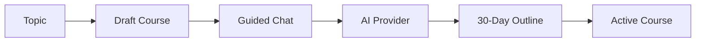
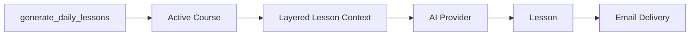
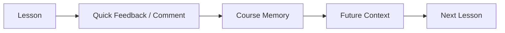

<div align="center">

# Thirty Lessons

**30 Days to Learn Anything**

A personal self-hosted learning app for turning a topic into a 30-day course, generating one lesson per day, sending lessons by email, and using feedback to steer future lessons.


</div>

Thirty Lessons helps one learner create and work through focused 30-day learning programs. You define a topic and goal, refine the course direction through an AI-guided chat, generate a 30-day outline, receive one lesson per day by email, and leave feedback that influences future lessons.

This is a personal self-hosted tool, not a SaaS product. It is intentionally small, local-first, and designed around clear extension points rather than a large platform architecture.

## Why I Built This

I built Thirty Lessons because I was already using AI to create learning plans, but the process was informal and easy to lose track of. The goal was to turn a vague idea, "AI-powered daily learning," into a small but usable self-hosted product with topics, courses, outlines, daily lessons, email delivery, feedback, and course memory.

The first usable version was built in about a day of focused work spread across a few days. That is context, not a claim that the app is finished or production hardened. It is intentionally not perfect or overbuilt, but the core workflow is designed with clear seams so it can grow over time.

## What It Does

- Creates learning topics and 30-day courses.
- Uses a chat-style refinement flow before outline generation.
- Generates and stores a structured 30-day outline.
- Activates, pauses, completes, or archives courses.
- Generates the next missing lesson for each active course.
- Sends lessons by email with plain-text and HTML bodies.
- Supports per-lesson discussion for follow-up questions and examples.
- Opens email feedback links on a confirmation modal instead of saving feedback on link visit.
- Stores quick feedback and optional comments with each lesson.
- Updates course memory so recurring feedback can influence future lessons.
- Uses sanitized Markdown rendering for lesson display.

## Engineering Notes

Thirty Lessons is intentionally small, but it demonstrates a few engineering decisions that matter when building AI-enabled software:

- turning an ambiguous workflow into a usable product
- keeping AI access behind a provider boundary
- using a deterministic fake provider for local development and tests
- validating generated outlines and lessons before saving them
- letting the Django application own workflow state
- using command-driven generation instead of adding background infrastructure too early
- packaging the app with Docker Compose so it can be run locally

AI is used as a provider, not as the owner of application state. Django stores the durable state, validates generated data, and decides when each AI call happens.

## Quickstart

Prerequisites:

- Docker
- Docker Compose

Build and start the app:

```bash
docker compose build
docker compose up
```

Open:

- Learning app: [http://localhost:8000](http://localhost:8000)
- Django admin: [http://localhost:8000/admin/](http://localhost:8000/admin/)
- Postgres: `localhost:5432`

The default Docker setup uses Postgres and Django's console email backend. Lessons will be printed to container logs unless SMTP is configured.

To create an admin user:

```bash
docker compose up -d web
docker compose exec web sh
python manage.py createsuperuser
```

## Local / Self-Hosted Security Posture

I currently run this as a local self-hosted tool behind Tailscale. That fits my use case, but it may not fit yours.

This project does not try to solve every deployment or security scenario. If you expose it beyond your local machine or private network, you are responsible for your own security posture: authentication, HTTPS, reverse proxy configuration, secrets management, database backups, allowed hosts, CSRF settings, and network access controls.

Treat the default Docker setup as a local development/self-hosting starting point, not a hardened public deployment recipe. Bring your own security posture.

## Useful Commands

Docker:

```bash
docker compose build
docker compose up
docker compose down
docker compose exec web sh
docker compose logs -f web
```

Database:

```bash
docker compose run --rm web python manage.py migrate
docker compose run --rm web python manage.py createsuperuser
```

Demo data:

```bash
docker compose run --rm web python manage.py seed_demo_data
```

Lesson generation:

```bash
docker compose run --rm web python manage.py generate_daily_lessons
docker compose run --rm web python manage.py generate_daily_lessons --no-email
./scripts/send_email.sh
```

`./scripts/send_email.sh` resolves the project root, loads `.env` and `.env.email` when present, updates course memory, then generates and emails daily lessons.

Email retry:

```bash
docker compose run --rm web python manage.py send_unsent_lessons
```

Course memory:

```bash
docker compose run --rm web python manage.py update_course_memory
docker compose run --rm web python manage.py update_course_memory <course_id>
```

Database backup:

```bash
./scripts/backup_db.sh
docker compose exec -T db psql --username learning --dbname learning < backups/<backup-file>.sql
```

Scheduler:

```bash
docker compose --profile scheduler up scheduler
docker compose run --rm scheduler python manage.py scheduler --interval-seconds 86400
```

Tests:

```bash
docker compose run --rm web python manage.py test
npm run test:e2e:docker
```

`npm run test:e2e:docker` creates a disposable Postgres database named `learning_e2e`, runs a separate `e2e-web` service on port `8001`, and drops the test database when the run finishes. It should not be pointed at the normal self-hosted database.

Host cron example:

```cron
0 8 * * * /home/user/Programming/30day-newsletter/scripts/send_email.sh >> /home/user/Programming/30day-newsletter/cron-email.log 2>&1
```

Cron uses the host's local timezone.

## Architecture

The app keeps the main workflow in Django models and service functions. AI access is isolated behind a provider interface, and daily generation is intentionally command-driven so it can run from cron, Docker, or the included scheduler.

### Course Creation Path



### Daily Lesson Path



### Feedback and Memory Path



For more detail on the AI flow, see [docs/ai-flows.md](docs/ai-flows.md).

## Extensibility

The app is intentionally designed around a few simple seams:

- AI provider logic is isolated, so another provider or local model could be added later.
- Daily lesson generation runs through Django management commands, which keeps it cron-friendly and avoids requiring Celery, or Django's new Task Framework, for the first version.
- Lesson context is built in one place from course settings, outline data, recent lesson summaries, feedback, and course memory.
- Lesson discussion is scoped to the current lesson, using bounded context instead of opening a separate general chat.
- Feedback affects future lessons rather than rewriting old lessons, keeping the workflow predictable.
- Email delivery uses Django's email backend, so local console email and SMTP both work through configuration.
- Server-rendered templates and HTMX keep the frontend small and easy to inspect.

The current app avoids Celery and heavier background infrastructure on purpose. That can be added later if the operational needs justify it.

## Configuration

### Core

- `SECRET_KEY` - Django secret key.
- `DEBUG` - defaults to `1` for local development.
- `ALLOWED_HOSTS` - comma-separated Django hosts.
- `CSRF_TRUSTED_ORIGINS` - comma-separated trusted origins.
- `DATABASE_URL` - uses Postgres when set, otherwise SQLite for local non-Docker runs.
- `SITE_BASE_URL` - base URL used in lesson emails.

### AI Provider

- `AI_PROVIDER` - `fake` or `openai`; defaults to `openai` when `OPENAI_KEY` is present, otherwise `fake`.
- `OPENAI_KEY` - OpenAI API key.
- `OPENAI_MODEL` - defaults to `gpt-5.5`.

The fake provider lets the app run locally without an API key and keeps tests deterministic.

### Email

- `EMAIL_BACKEND` - defaults to Django console email backend.
- `EMAIL_HOST`
- `EMAIL_PORT`
- `EMAIL_USE_TLS`
- `EMAIL_USE_SSL`
- `EMAIL_HOST_USER`
- `EMAIL_HOST_PASSWORD`
- `DEFAULT_FROM_EMAIL`
- `LESSON_RECIPIENT_EMAIL`

Example `.env` for OpenAI and SMTP:

```bash
OPENAI_KEY=sk-your-key
OPENAI_MODEL=gpt-5.5

EMAIL_BACKEND=django.core.mail.backends.smtp.EmailBackend
EMAIL_HOST=smtp.mailprovider.com
EMAIL_PORT=465
EMAIL_USE_SSL=1
EMAIL_USE_TLS=0
EMAIL_HOST_USER=you@example.com
EMAIL_HOST_PASSWORD=your-app-password
DEFAULT_FROM_EMAIL=you@example.com
LESSON_RECIPIENT_EMAIL=you@example.com
SITE_BASE_URL=http://localhost:8000
```

Run with:

```bash
docker compose --env-file .env up
```

## Project Structure

```text
manage.py                   Root Django command entrypoint; adds src/ to Python path
src/learning_platform/      Django project settings and root URLs
src/courses/                Main app: models, views, forms, services, AI provider
src/courses/templates/      Server-rendered pages and HTMX partials
src/courses/management/commands Management commands for generation, email, memory, scheduler
src/courses/tests/          Django unit and integration tests
tests/e2e/                  Playwright browser tests
scripts/                    Local helper scripts for cron/manual operations
docker/                     Container entrypoint and Docker support files
docs/                       Project notes, including AI flow documentation
docker-compose.yml          Local/self-hosted app + Postgres runtime
Dockerfile                  Python app image
```

The app uses a `src/` layout. Docker sets `PYTHONPATH=/app/src`, and `manage.py` adds local `src/` to `sys.path` so normal commands like `python manage.py test` still work from the repository root.

## Non-Goals

- Billing, teams, public course sharing, or multi-user account management.
- Full LMS features such as quizzes, certificates, grading, or analytics dashboards.
- Production-grade deployment hardening.
- Mobile apps.
- Heavy client-side JavaScript.

## Contributing / Next Steps

This is a first usable version of a personal self-hosted tool. Changes should stay focused around the core learning workflow and self-hosted operation.

Useful next steps:

- stronger outline and lesson response validation
- richer course progress views
- optional local-model provider
- better operational docs for private-network self-hosting
- a documented reverse proxy recipe for people who choose to expose it
- more focused tests around AI context construction
