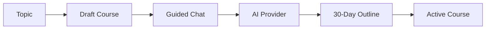
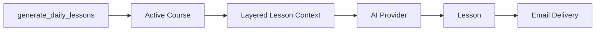
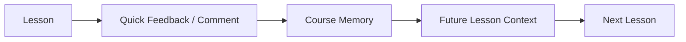

<div align="center">

# Thirty Lessons

**30 Days to Learn Anything**

A personal self-hosted learning app: topic planning → AI-guided course outline → daily lesson generation → email delivery → feedback-informed future lessons.


</div>

> **Intent:** This is a personal, self-hosted OSS project, not a SaaS product. It is built to help one learner create 30-day learning programs, receive one lesson per day by email, and use lightweight feedback to steer future lessons.

## 📌 Table of Contents
- [Overview](#overview)
- [Key Features](#key-features)
- [Design Tradeoffs](#design-tradeoffs-intentional)
- [Non-goals](#non-goals)
- [Quickstart](#quickstart)
- [Local Endpoints](#local-endpoints)
- [Useful Commands](#useful-commands)
- [Technologies](#technologies)
- [Architecture](#architecture)
- [Configuration](#configuration)
- [Project Structure](#project-structure)
- [Contributing / Next Steps](#contributing--next-steps)

## ✨ Overview
- 🧭 **Topic-first course planning**: create a broad topic, then define a 30-day program around a goal, audience level, lesson style, and daily time commitment.
- 💬 **Guided chat refinement**: use a chat-style interface to clarify direction before generating the course outline.
- 🧠 **AI provider boundary**: OpenAI support sits behind a small provider abstraction, with a fake provider available for local/demo usage.
- 🗓️ **30-day outline generation**: each course stores a generated outline and can be activated only after an outline exists.
- ✉️ **Daily lesson delivery**: a management command generates the next missing lesson for each active course and sends it by email.
- 🔁 **Feedback loop**: quick feedback and freeform comments are stored with each lesson and included in future lesson context.
- 🗃️ **Course memory**: a compressed memory record keeps long-running context useful without sending the entire history forever.

## ✅ Key Features
- Django server-rendered UI with HTMX partial updates for chat, outline, status, and feedback panels.
- Topic, course, lesson, feedback, chat message, and course memory models.
- Course lifecycle states: `draft`, `active`, `paused`, `completed`, `archived`.
- Daily generation command designed to run from cron, Docker, or the included scheduler command.
- Email delivery through Django's email backend, with console email by default and SMTP support through env vars.
- Markdown lesson rendering with HTML sanitization before display.
- Docker Compose setup with Django app + Postgres.
- Unit/integration tests for models, services, views, AI provider behavior, and management commands.
- Playwright smoke/workflow tests for browser-level behavior.

## ⚖️ Design Tradeoffs (Intentional)
- The app is optimized for **personal self-hosting**, not multi-tenant SaaS concerns.
- A simple Django management command is used for daily lesson generation instead of introducing Celery early.
- The fake AI provider makes the app runnable without an API key and keeps tests deterministic.
- Course generation uses layered context rather than sending every historical record to the model.
- Server-rendered templates and HTMX keep the frontend small and easy to inspect.

## 🚫 Non-goals
- Billing, teams, public course sharing, or multi-user account management.
- Full LMS features such as quizzes, certificates, grading, or analytics dashboards.
- Production-grade deployment hardening in the MVP.
- Mobile apps or heavy client-side JavaScript.

## 🚀 Quickstart
- Prereqs: Docker and Docker Compose.
- Build and start the app:
  - `docker compose build`
  - `docker compose up`
- Open the app:
  - [http://localhost:8000](http://localhost:8000)

The default Docker setup uses Postgres and Django's console email backend. Lessons will be printed to container logs unless SMTP is configured.

### Optional: OpenAI + SMTP
Create a `.env` file from `.env.example` and set:

```bash
OPENAI_KEY=sk-your-key
OPENAI_MODEL=gpt-4.1-mini

EMAIL_BACKEND=django.core.mail.backends.smtp.EmailBackend
EMAIL_HOST=smtp.fastmail.com
EMAIL_PORT=465
EMAIL_USE_SSL=1
EMAIL_USE_TLS=0
EMAIL_HOST_USER=you@example.com
EMAIL_HOST_PASSWORD=your-app-password
DEFAULT_FROM_EMAIL=you@example.com
LESSON_RECIPIENT_EMAIL=you@example.com
SITE_BASE_URL=http://localhost:8000
```

Then run:

```bash
docker compose --env-file .env up
```

## 🔗 Local Endpoints
- Learning app: [http://localhost:8000](http://localhost:8000)
- Django admin: [http://localhost:8000/admin/](http://localhost:8000/admin/)
- Postgres: `localhost:5432`

## 🛠 Useful Commands
- Docker:
  - `docker compose build`
  - `docker compose up`
  - `docker compose down`
  - `docker compose exec web sh`
  - `docker compose logs -f web`
- Database:
  - `docker compose run --rm web python manage.py migrate`
  - `docker compose run --rm web python manage.py createsuperuser`
- Admin user:
  - start the app with `docker compose up -d web`
  - shell into the running container with `docker compose exec web sh`
  - create an admin login with `python manage.py createsuperuser`
  - sign in at [http://localhost:8000/admin/](http://localhost:8000/admin/)
- Demo data:
  - `docker compose run --rm web python manage.py seed_demo_data`
- Lesson generation:
  - `docker compose run --rm web python manage.py generate_daily_lessons`
  - `docker compose run --rm web python manage.py generate_daily_lessons --no-email`
  - `./scripts/send_email.sh` updates course memory, then generates and emails daily lessons.
- Email retry:
  - `docker compose run --rm web python manage.py send_unsent_lessons`
- Course memory:
  - `docker compose run --rm web python manage.py update_course_memory`
  - `docker compose run --rm web python manage.py update_course_memory <course_id>`
- Scheduler:
  - `docker compose --profile scheduler up scheduler`
  - `docker compose run --rm scheduler python manage.py scheduler --interval-seconds 86400`
- Tests:
  - `docker compose run --rm web python manage.py test`
  - `AI_PROVIDER=fake OPENAI_KEY= docker compose up -d web`
  - `npm run test:e2e:docker`

### Cron Email Run
For a host cron job, point at the script in `scripts/`. The script resolves the project root, loads `.env` and `.env.email` when present, updates course memory, and runs the daily lesson command in Docker:

```cron
0 7 * * * /path/to/30day-newsletter/scripts/send_email.sh >> /path/to/30day-newsletter/cron-email.log 2>&1
```

## 🧰 Technologies
- Python 3.12
- Django 5.x
- Django templates
- HTMX
- Postgres 16
- Markdown + Bleach
- OpenAI Python SDK
- Docker Compose
- Playwright

## 🧭 Architecture

The app keeps the main workflow in Django models and service functions, with AI access isolated behind a provider interface. Daily generation is intentionally command-driven so it can be run by cron, Docker, or the included scheduler.

### 1) Course creation path (Topic → Chat → Outline)


### 2) Daily lesson path (Active Course → Lesson → Email)


### 3) Feedback and memory path (Lesson Feedback → Future Context)


## ⚙️ Configuration

### Core
- `SECRET_KEY` - Django secret key.
- `DEBUG` - defaults to `1` for local development.
- `ALLOWED_HOSTS` - comma-separated Django hosts.
- `CSRF_TRUSTED_ORIGINS` - comma-separated trusted origins.
- `DATABASE_URL` - uses Postgres when set, otherwise SQLite for local non-Docker runs.
- `SITE_BASE_URL` - base URL used in lesson emails.

### AI Provider
- `AI_PROVIDER` - `fake` or `openai`; defaults to `openai` when `OPENAI_KEY` is present, otherwise `fake`.
- `OPENAI_KEY` - OpenAI API key.
- `OPENAI_MODEL` - defaults to `gpt-4.1-mini`.

### Email
- `EMAIL_BACKEND` - defaults to Django console email backend.
- `EMAIL_HOST`
- `EMAIL_PORT`
- `EMAIL_USE_TLS`
- `EMAIL_USE_SSL`
- `EMAIL_HOST_USER`
- `EMAIL_HOST_PASSWORD`
- `DEFAULT_FROM_EMAIL`
- `LESSON_RECIPIENT_EMAIL`

## 📁 Project Structure
```text
manage.py                   Root Django command entrypoint; adds src/ to Python path
src/learning_platform/      Django project settings and root URLs
src/courses/                Main app: models, views, forms, services, AI provider
src/courses/templates/      Server-rendered pages and HTMX partials
src/courses/management/commands Management commands for generation, email, memory, scheduler
src/courses/tests/          Django unit and integration tests
tests/e2e/                  Playwright browser tests
scripts/                    Local helper scripts for cron/manual operations
docker/                     Container entrypoint and Docker support files
docs/                       Project notes and original specification
docker-compose.yml          Local/self-hosted app + Postgres runtime
Dockerfile                  Python app image
```

The app uses a `src/` layout. Docker sets `PYTHONPATH=/app/src`, and `manage.py` adds local `src/` to `sys.path` so normal commands like `python manage.py test` still work from the repository root.

## 🤝 Contributing / Next Steps
- Keep changes focused around personal learning workflows and self-hosted operation.
- Add tests for behavior changes, especially AI output validation and daily generation rules.
- Future ideas:
  - signed/idempotent email feedback links
  - stronger outline and lesson response validation
  - richer course progress views
  - optional local-model provider
  - a documented production-ish reverse proxy recipe for later self-hosted deployment
